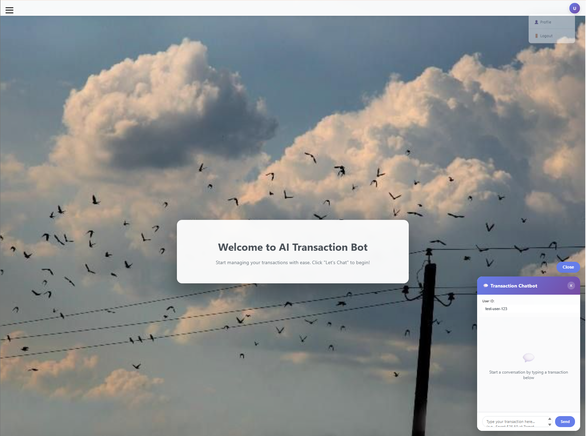
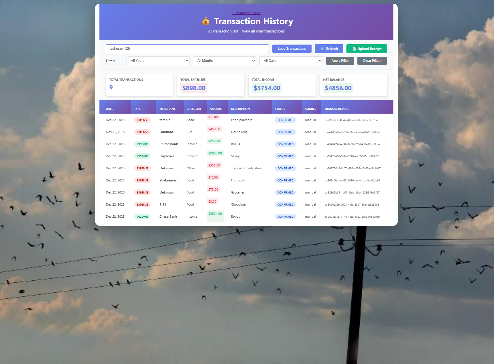

# AI-Driven Transaction Processing System (AI Transaction Bot)

A full-stack web app that lets users record transactions by chatting in natural language or uploading receipt images. The system uses OCR + an LLM to extract structured transaction data, validates it, prevents duplicates, stores it in DynamoDB, and displays history + analytics in a simple dashboard.

---
## demo video - link
https://youtu.be/U4NHH2ImYfg
## Screenshots

### 1. Landing Page

### 2. Chatbot Page

### 3. Transaction History Page

### 4. Dashboard Page

### 5. Upload Receipt Page

---

## Features

###  Transaction capture (2 ways)
- **Chat input**: “Spent $12.50 at Starbucks yesterday”
- **Receipt upload**: Upload JPG/PNG → OCR (Textract) → structured transaction

###  AI + OCR pipeline
- **AWS Textract** extracts receipt text
- **OpenAI (GPT-4o-mini)** converts text to strict structured JSON:
  - `amount`, `date`, `merchant`, `category`, `type` (expense/income), `currency`, `description`
- Smart date handling:
  - Resolves **today / yesterday**
  - Prevents dates that are too old or in the future (safe correction logic)

###  Data quality + reliability
- Field validation for all transaction fields
- Duplicate detection (prevents saving repeated transactions)
- Custom error classes:
  - `ValidationError`, `DatabaseError`, `LLMError`, `OCRError`
- Centralized error-handling middleware

###  Web UI (Vanilla HTML/CSS/JS)
- **Chatbot page** to record transactions manually
- **Receipt upload page** with preview + confirmation
- **Transaction history page** with:
  - Table view
  - Auto-apply filters: Year / Month / Day
  - Fixed date display (timezone-safe)
- **Dashboard page** with:
  - Total Expenses / Income / Net Balance
  - Monthly expense trend (line chart)
  - Income vs Expenses (bar chart)
  - Month-over-month expense change indicator

---

## Tech Stack

- **Backend**: Node.js, Express.js
- **Database**: AWS DynamoDB
- **OCR**: AWS Textract
- **AI**: OpenAI API (GPT-4o-mini)
- **Frontend**: HTML, CSS, Vanilla JS
- **Uploads**: Multer
- **Charts**: Chart.js

---

## Project Structure

AItransactionbot/
├── src/
│ ├── config/
│ │ └── aws.js
│ ├── routes/
│ │ └── chat.js
│ ├── services/
│ │ ├── llmServices.js
│ │ ├── ocrServices.js
│ │ ├── dynamodbService.js
│ │ └── transactionService.js
│ ├── utils/
│ │ ├── errors.js
│ │ └── validation.js
│ └── server.js
├── public/
│ ├── mainpage.html
│ ├── upload.html
│ ├── transactions.html
│ ├── dashboard.html
│ ├── js/
│ │ ├── chat.js
│ │ └── dashboard.js
│ └── css/
│ └── styles.css
└── .env

## How It Works (Flow)

1. User submits a transaction via chat or uploads a receipt
2. If receipt, AWS Textract extracts text
3. LLM converts text into structured transaction data
4. Validation ensures data integrity
5. Duplicate detection prevents repeated transactions
6. Data is saved to DynamoDB
7. UI confirms the transaction and updates history and dashboard
